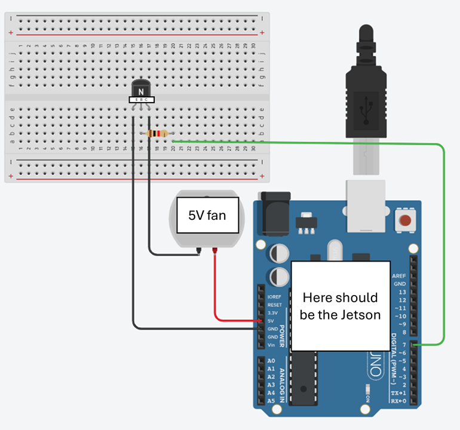

# Auto Fan Service

Controls a fan on the Jetson Nano based on CPU temperature.

## Hardware Setup
You will need:
   - Nvidia Jetson Nano Dev Kit.
   - 5V fan with 2-pins: VCC and GND (size 40mm x 40mm to fit the Jetson heatsink mounting holes, M 2.5 screws).
   - NPN transistor (I used 2N2222).
   - 1K Ohm resistor.
   - Breadboard.
   - Some jupmer wires.

### Wiring instructions:
   - Mount the fan to the heatsink using M 2.5 screws.
   - Fan + (Red wire) → 5V pin on Jetson Nano.
   - Fan – (Black wire) → Collector of NPN transistor.
   - Transistor Emitter → GND pin on Jetson Nano.
   - Transistor Base → GPIO pin (through a 1kΩ resistor) - I used GPIO 7.

### Wiring Diagram:



## Fan configurations
The fan behavior is configured directly inside fan_control.py:
```python
FAN_PIN = 7           # BOARD pin number connected to the fan's transistor
TEMP_THRESHOLD = 35   # Temperature threshold in °C to turn on the fan
SLEEP_SECONDS = 10    # Seconds between checks
```

## Set up the systemd service
This makes the script runs automatically in the background when you the Jetson boots.

1. Update `fancontrol.service` file:

   - Replace `/path/to/jetson-tools/` with your local path.
   - Replace `yourusername` with your Linux username.

2. Copy the service file to the systemd directory:

   ```bash
   sudo cp auto_fan_service/fancontrol.service /etc/systemd/system/
   ```

2. Enable and start the service:

   ```bash
   sudo systemctl daemon-reexec
   sudo systemctl enable fancontrol.service
   sudo systemctl start fancontrol.service
   ```

3. Check service status:

   ```bash
   systemctl status fancontrol.service
   ```

